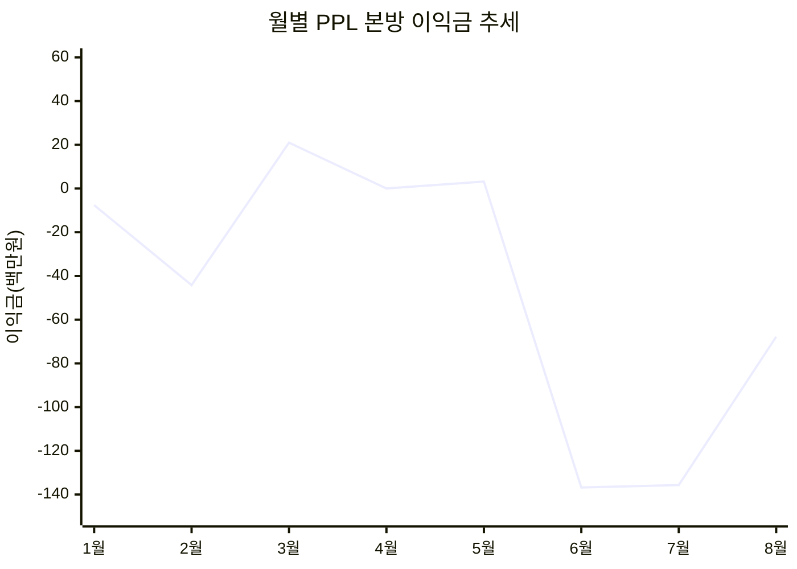
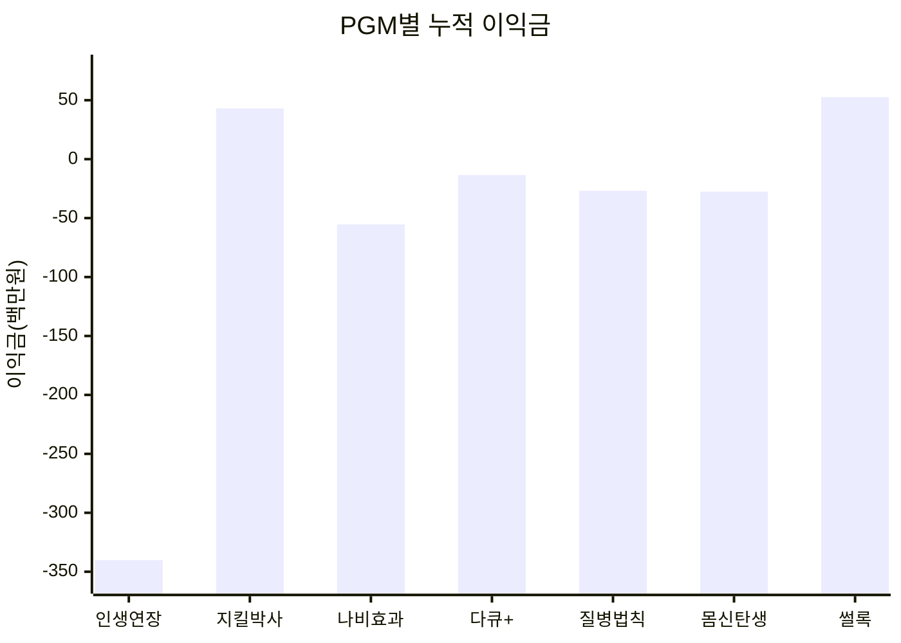
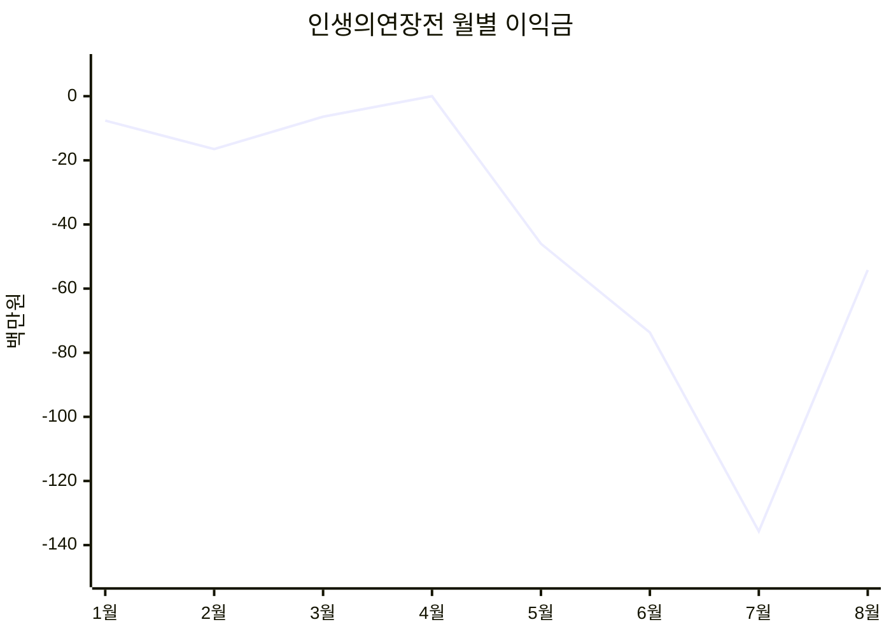
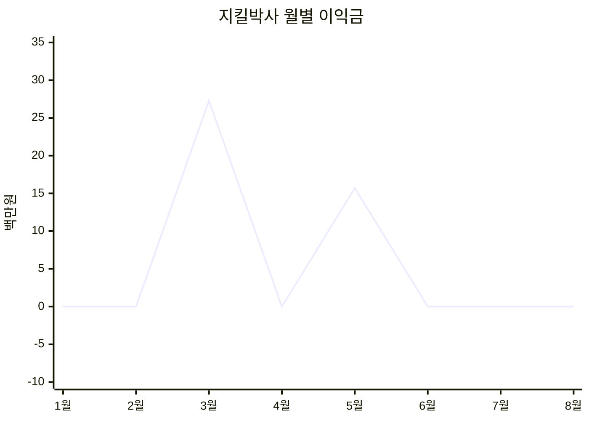
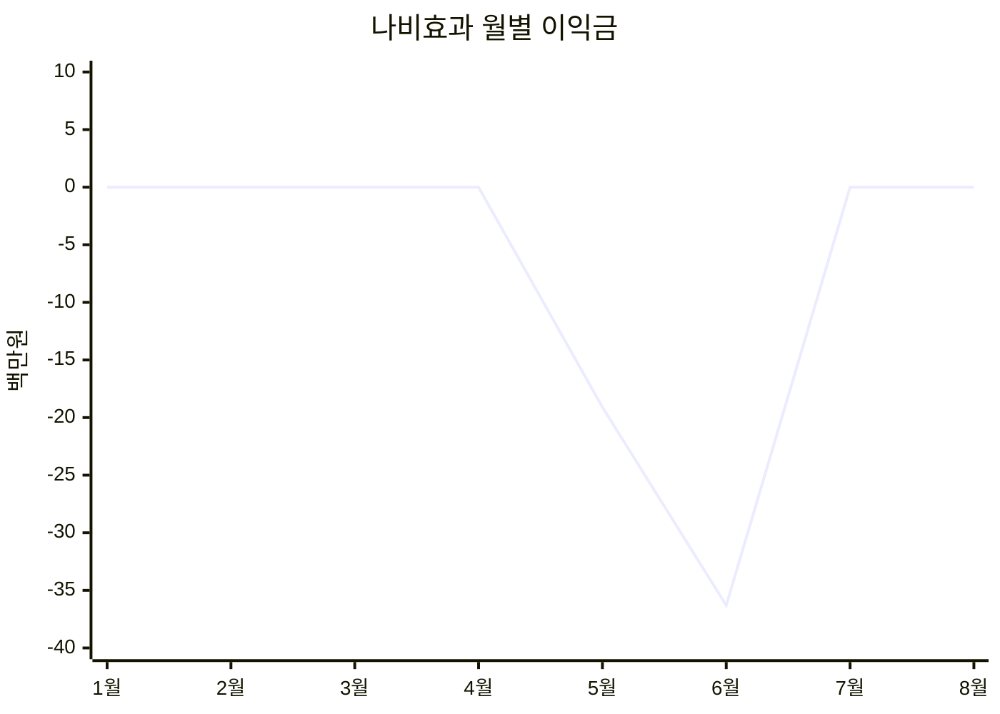
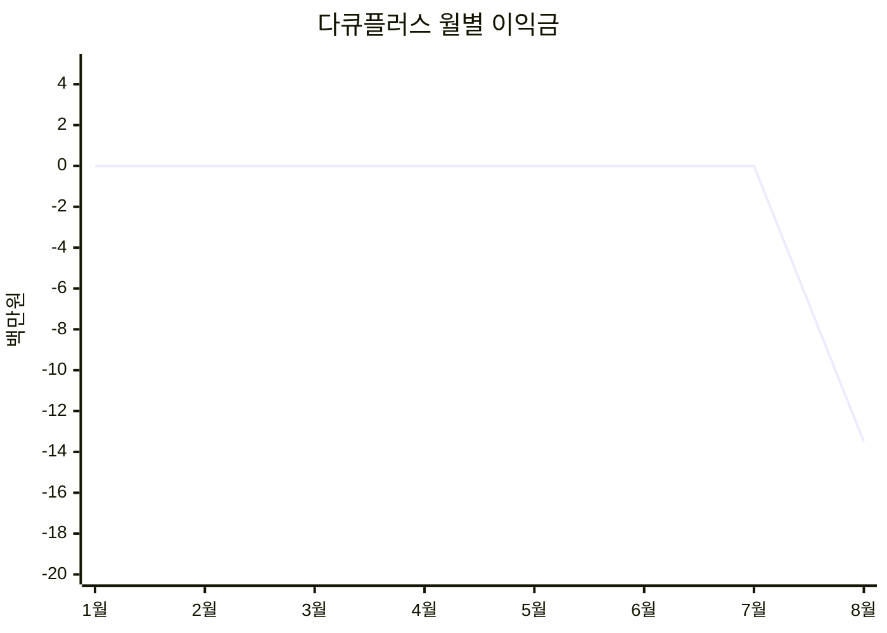
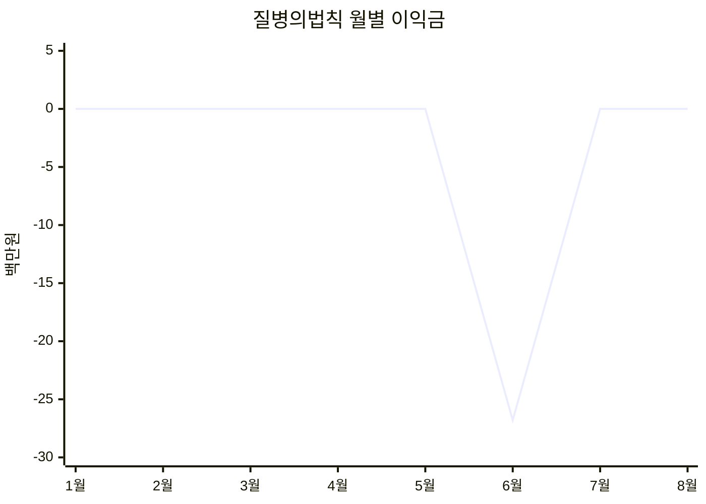
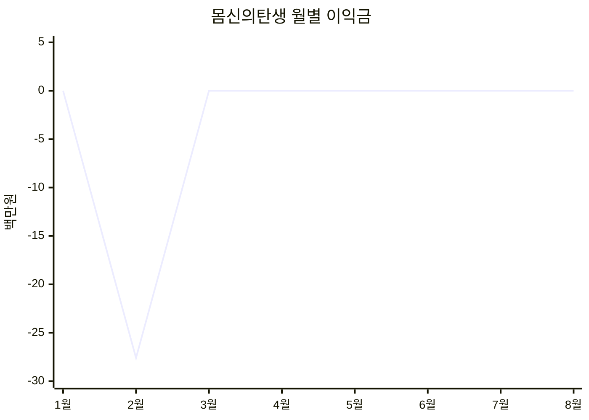
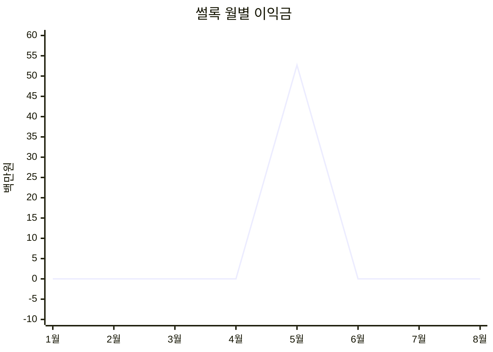

# 2026년 PPL 본방 손익 보고서

> **실적 기준일:** 2026년 8월 12일  
> **본방 판정 기준:** PPL PGM(X열)이 입력되어 있고 PPL 비용(AB열)이 50,000,000원 이상인 방송  
> **손익 기준:** 원본 S열 `이익금`  
> **금액 단위:** 표와 그래프는 백만원, 별도 표기가 있는 경우 원

## 1. 핵심 요약

| 지표 | 실적 |
|---|---:|
| 본방 건수 | 18건 |
| 주문금액 | 4,069.7백만원 |
| PPL 비용 | 1,036.9백만원 |
| 누적 이익금 | **-367.8백만원** |
| 누적 손익률 | **-9.0%** |

### 주요 확인사항

- 3월은 **+21.0백만원**, 5월은 **+3.2백만원**으로 월간 흑자를 기록했습니다.
- 6월과 7월의 합산 손실은 **-272.5백만원**으로, 전체 누적 손실의 약 **74.1%**가 두 달에 집중되었습니다.
- `인생의연장전`은 전체 18건 중 10건을 차지했으며 누적 손익은 **-340.2백만원**입니다.
- PGM 누적 기준 흑자는 `썰록` **+52.7백만원**, `지킬박사` **+43.0백만원**입니다.
- 본방 표기와 재방송 표기가 원본에 별도로 존재하지 않아, 이번 보고서는 PPL 비용 5천만원 이상 기준으로 본방을 판정했습니다.

---

## 2. 전체 월별 본방 요약

### 월별 손익표

| 월 | 본방 건수 | 주문금액 | PPL 비용 | 이익금 | 손익률 |
|---|---:|---:|---:|---:|---:|
| 1월 | 1 | 207.2 | 59.8 | -7.6 | -3.7% |
| 2월 | 2 | 334.6 | 110.4 | -44.2 | -13.2% |
| 3월 | 2 | 408.0 | 110.4 | **+21.0** | **+5.1%** |
| 4월 | 0 | — | — | — | — |
| 5월 | 5 | 1,336.5 | 300.1 | **+3.2** | **+0.2%** |
| 6월 | 4 | 717.0 | 225.4 | **-136.8** | **-19.1%** |
| 7월 | 2 | 474.0 | 116.3 | **-135.7** | **-28.6%** |
| 8월 | 2 | 592.5 | 114.5 | **-67.8** | **-11.4%** |
| **합계** | **18** | **4,069.7** | **1,036.9** | **-367.8** | **-9.0%** |

### 월별 이익금 추세

> 4월은 본방 실적이 없어 그래프에서 0으로 표시했습니다.

---

## 3. PGM별 누적 손익

### PGM별 누적 손익표

| PPL PGM | 본방 건수 | 주문금액 | PPL 비용 | 누적 이익금 | 손익률 | 건당 평균 이익금 |
|---|---:|---:|---:|---:|---:|---:|
| 인생의연장전 | 10 | 2,316.0 | 594.0 | **-340.2** | -14.7% | -34.0 |
| 지킬박사 | 2 | 630.9 | 101.2 | **+43.0** | +6.8% | +21.5 |
| 나비효과 | 2 | 326.5 | 131.3 | **-55.4** | -17.0% | -27.7 |
| 다큐플러스 | 1 | 247.2 | 54.0 | **-13.5** | -5.5% | -13.5 |
| 질병의법칙 | 1 | 104.5 | 55.2 | **-26.8** | -25.6% | -26.8 |
| 몸신의탄생 | 1 | 152.8 | 50.6 | **-27.6** | -18.1% | -27.6 |
| 썰록 | 1 | 291.9 | 50.6 | **+52.7** | +18.0% | +52.7 |
| **합계** | **18** | **4,069.7** | **1,036.9** | **-367.8** | **-9.0%** | **-20.4** |

### PGM별 누적 이익금 비교

### PGM별 판단

| 구분 | PGM | 판단 |
|---|---|---|
| 수익 유지 검토 | 썰록, 지킬박사 | 누적 이익과 손익률이 모두 플러스입니다. 추가 편성 시 재현 가능성 확인이 필요합니다. |
| 집중 개선 필요 | 인생의연장전 | 방송 건수가 가장 많고 누적 손실 규모도 가장 큽니다. 아이템·채널·편성 조건별 세부 분리가 우선입니다. |
| 손실 구조 점검 | 나비효과, 질병의법칙, 몸신의탄생 | 건당 손실이 약 26.8~27.7백만원으로 유사합니다. PPL비 회수 가능한 주문금액 기준을 다시 설정할 필요가 있습니다. |
| 추가 관찰 | 다큐플러스 | 실적이 1건뿐이므로 단일 결과만으로 확대·축소 판단하기 어렵습니다. |

---

## 4. PGM별 월별 손익

### PGM별 월간 이익금표

| 월 | 나비효과 | 다큐플러스 | 몸신의탄생 | 썰록 | 인생의연장전 | 지킬박사 | 질병의법칙 |
|---|---:|---:|---:|---:|---:|---:|---:|
| 1월 | — | — | — | — | -7.6 | — | — |
| 2월 | — | — | -27.6 | — | -16.5 | — | — |
| 3월 | — | — | — | — | -6.4 | +27.3 | — |
| 4월 | — | — | — | — | — | — | — |
| 5월 | -19.1 | — | — | +52.7 | -46.0 | +15.7 | — |
| 6월 | -36.3 | — | — | — | -73.7 | — | -26.8 |
| 7월 | — | — | — | — | -135.7 | — | — |
| 8월 | — | -13.5 | — | — | -54.2 | — | — |

> 표의 `—`는 손익 0원이 아니라 해당 월에 해당 PGM 본방이 없었음을 의미합니다. 아래 그래프에서는 월간 흐름을 동일한 축으로 보여주기 위해 방송이 없는 월을 0으로 표시했습니다.

### 인생의연장전 월별 손익

### 지킬박사 월별 손익

### 나비효과 월별 손익

### 다큐플러스 월별 손익

### 질병의법칙 월별 손익

### 몸신의탄생 월별 손익

### 썰록 월별 손익

---

## 5. 결론 및 검토 방향

1. `인생의연장전`은 월별 손실 폭이 5월부터 확대됐고 7월에 **-135.7백만원**으로 가장 큰 손실을 기록했습니다. 방송 횟수 축소 여부보다 먼저 아이템과 홈쇼핑 채널별 손익을 분리해 원인을 확인해야 합니다.
2. 6~7월 손실 집중의 원인이 PPL비 상승, 주문금액 감소, 아이템 수익성 저하 중 어디에서 발생했는지 세부 분해가 필요합니다.
3. `썰록`과 `지킬박사`는 흑자 사례이나 표본이 각각 1건과 2건이므로, 동일 조건의 추가 편성 결과를 누적한 뒤 확대 여부를 판단하는 것이 적절합니다.
4. 신규 본방 편성 시에는 PPL 비용만으로 판단하지 않고 `예상 주문금액 → 예상 이익금 → 손익분기 주문금액`을 사전에 산출하는 운영 기준이 필요합니다.

---

### 산출 기준

- 원본: `방송현황종합 2026` 시트
- 집계 대상: 2026년 1월 1일~8월 12일
- 본방 조건: PPL PGM 입력 및 PPL 비용 50,000,000원 이상
- 손익 항목: 이익금(S열)
- 검증: `PPL본방_PGM별_월별추세_보고서.xlsx`와 상세 18건, 월별·PGM별 합계를 교차 검증함
